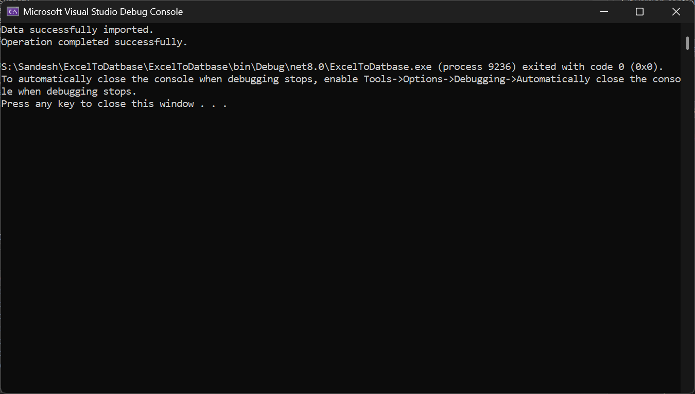
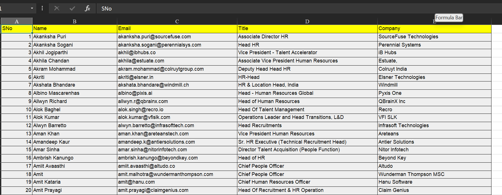
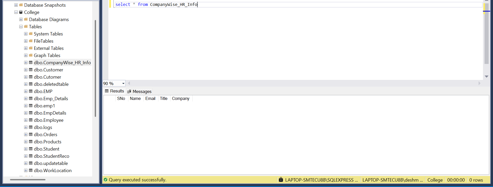
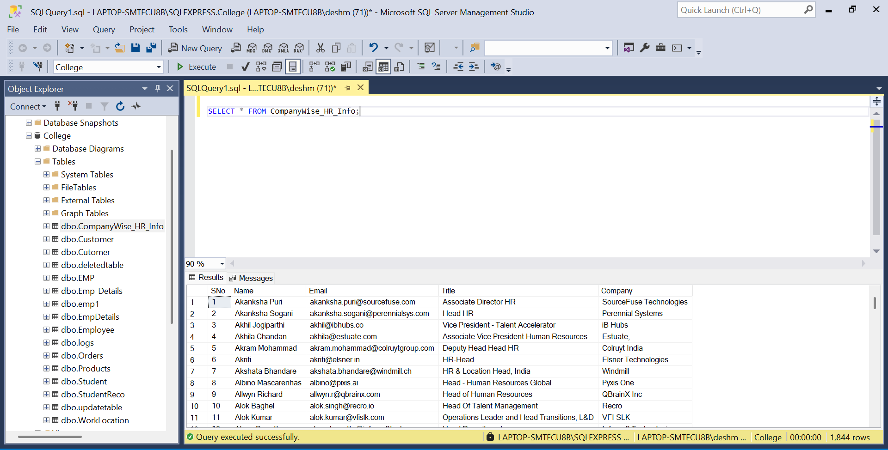

# ExcelToDatbase
This documentation explains the structure, purpose, and technologies used in your `.NET` console application for importing Excel data into SQL Server using `SqlBulkCopy`.

---

# 📊 Excel to SQL Importer

A .NET console application that reads data from an Excel file (`XLS/XLSX`) and bulk inserts it into a SQL Server database table.

---

## 🧩 Overview

This application automates the process of transferring data from an Excel spreadsheet into a SQL Server database. It uses **ADO.NET**, **OleDb**, and **SqlBulkCopy** to read and insert data efficiently.

---

## 🛠️ Technologies & Libraries Used

| Technology / Library | Description |
|----------------------|-------------|
| **.NET 8**           | Console application framework |
| **System.Data**      | Core ADO.NET namespace for working with data |
| **Microsoft.Data.SqlClient** | For connecting and interacting with SQL Server |
| **System.Data.OleDb** | For reading Excel files via OLE DB providers |
| **SqlBulkCopy**      | High-performance tool for inserting large volumes of data into SQL Server |
| **Excel (XLS/XLSX)** | Input data source format |

---

## 📁 Project Structure

- `Program.cs` – Main logic file:
  - Reads Excel file
  - Converts data into a `DataTable`
  - Performs bulk insert into SQL Server

---

## 🧠 Code Explanation

### 🖥️ Entry Point: `Main`

```csharp
static void Main(string[] args)
```

- Sets up the file path, connection string, and destination table name.
- Calls `ReadExcelToDataTable()` to load Excel data.
- Calls `BulkInsertIntoSqlServer()` to import data into SQL Server.
- Handles exceptions and displays success/error messages.

---

### 📄 Reading Excel Data: `ReadExcelToDataTable`

```csharp
static DataTable ReadExcelToDataTable(string filePath)
```

- Checks if the file exists.
- Determines file type (`.xls` or `.xlsx`) and selects the appropriate OleDb provider.
- Opens the Excel file using `OleDbConnection`.
- Retrieves schema to get worksheet names.
- Loads all data from the first sheet into a `DataTable`.

> This method ensures flexibility by supporting both older and newer Excel formats.

---

### 🚀 Bulk Insert into SQL Server: `BulkInsertIntoSqlServer`

```csharp
static void BulkInsertIntoSqlServer(DataTable dt, string connString, string destinationTable)
```

- Opens a connection to SQL Server.
- Uses `SqlBulkCopy` to map columns and perform fast insertion.
- Maps each column in the `DataTable` to the corresponding column in the SQL table.
- Inserts the full dataset into the target table.

> `SqlBulkCopy` is ideal for performance-critical scenarios involving large datasets.

---

## 📦 Requirements

- [.NET SDK 6 or 7](https://dotnet.microsoft.com/download)
- Microsoft Access Database Engine (for `.xlsx/.xls` support)  
- SQL Server instance with write access to the target database
- Excel file with structured tabular data

---

## 🔧 Setup Instructions

1. Install required .NET runtime/sdk
2. Ensure the correct **OLEDB provider** is installed:
   - [Microsoft Access Database Engine 2010 Redistributable](https://www.microsoft.com/en-us/download/details.aspx?id=13255)
3. Update the following values in `Program.cs`:

```csharp
string excelFilePath = @"S:\user\ExcelToDatbase\CompanyWise_HR_Info.xlsx";
string connectionString = "Server=LAPTOP-SMTECU8B\\SQLEXPRESS;Database=College;TrustServerCertificate=True;Trusted_Connection=True;";
string tableName = "CompanyWise_HR_Info";
```

4. Build and run the project:
```bash
dotnet build
dotnet run
```
---

## 🧪 Sample Output

```
Data successfully imported.
Operation completed successfully.
```

Or in case of error:

```
An error occurred: The specified Excel file does not exist.
```

---

## 📷 Screenshots

> Screenshots showing execution output, sample Excel file, and database results before and after.

| Description                        | Screenshot                                                                |
|------------------------------------|---------------------------------------------------------------------------|
| Console Execution Output           |                          |
| Excel File Preview                 |                            |
| SQL Table Before Insertion         |  |
| SQL Table After Insertion          |                      |

---

## ⚠️ Notes

- Ensure the SQL table schema matches the Excel columns exactly.
- If you're on a **64-bit system**, install the **64-bit version** of the Access Database Engine.
- For production use, consider adding logging, configuration management, and unit tests.

---

## 💡 Future Improvements

- Support multiple worksheets
- Add column mapping customization
- Use Entity Framework for ORM-based insertion
- Create a GUI interface (e.g., WPF or WinForms)

---

## 🤝 Contributing

Contributions are welcome! Fork the repo, make improvements, and submit a pull request.

---

## 📜 License

MIT License – see [LICENSE](LICENSE) for details.

---
Happy Coding !!!
